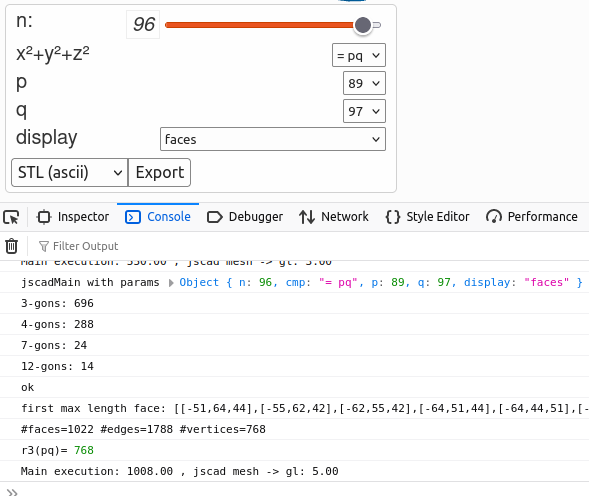
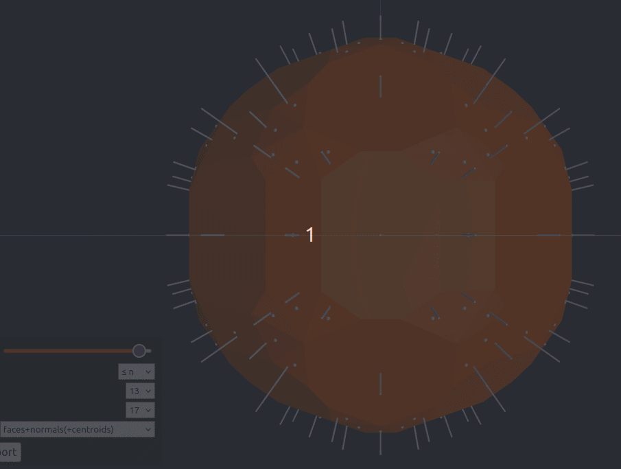
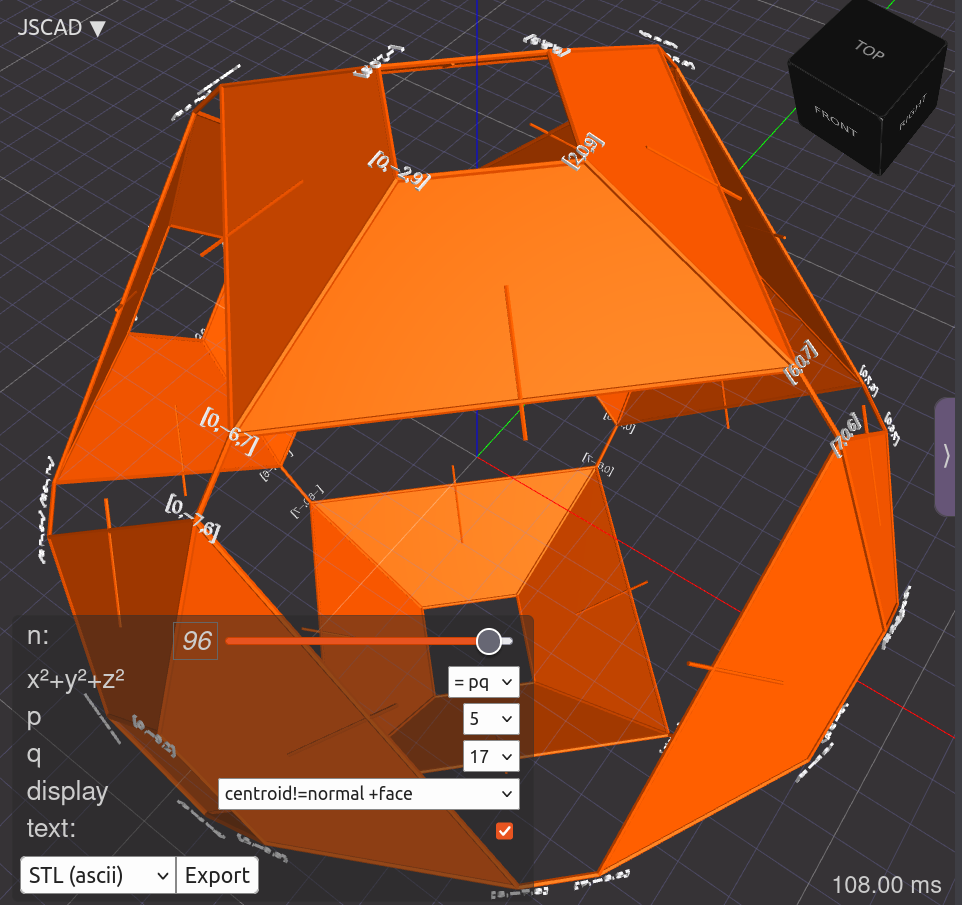
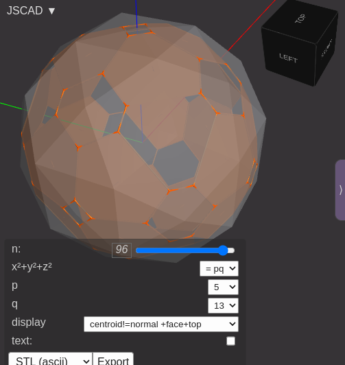
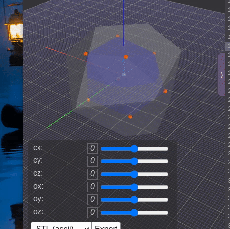

The Makefile in this repo was used to publisch .html pages with redirect to https://jscad.app of the JSCAD applications discussed below.  

That is not needed anymore, the (raw) .js file JSCAD models of this repo can directly be used by appending the raw file URL to <kbd>https://jscad.app/#</kbd>. Below are the three JSCAD apps from this repo with those URLs to execute directly in your browser:  

- https://jscad.app/#https://github.com/Hermann-SW/lattice_sphere_cmp/raw/refs/heads/main/lattice_sphere_cmp.js  
- https://jscad.app/#https://github.com/Hermann-SW/lattice_sphere_cmp/raw/refs/heads/main/tangential_faces.js  
- https://jscad.app/#https://github.com/Hermann-SW/lattice_sphere_cmp/raw/refs/heads/main/pt.js  

# lattice_sphere_cmp

$hull(p\in\mathbb{Z}^3, norml2(p)==n)$ for $n\neq 4^a(8b+7)$ is a [lattice polyhedron](https://en.wikipedia.org/wiki/Polyhedron#Lattice_polyhedra). By [Legendre's three-square theorem](https://en.wikipedia.org/wiki/Legendre%27s_three-square_theorem), such $n$ have representation(s) as the sum of $3$ squares.

After updating <kbd>lattice_sphere_cmp.js</kbd>, run <kbd>make</kbd> and then open [index.html](index.html) in browser.

You can use last pushed version on github.io:  
https://Hermann-sw.github.io/lattice_sphere_cmp

Related question:  
https://math.stackexchange.com/questions/4917740/which-faces-does-sphere-lattice-polyhedron-operatornamehullp-in-mathbbz

Analysis output added (#faces/#edges/#vertices) in 3rd last logged line.  
In case of cmp="= pq" output of [r3](https://en.wikipedia.org/wiki/Sum_of_squares_function#k_=_3)(pq) as well (should be same as #vertices).  

Dual of lattice sphere (dual vertices determined with small system of 3 linear equations solver for each face):  

Experimental:  
https://hermann-sw.github.io/lattice_sphere_cmp/tangential_faces.html

