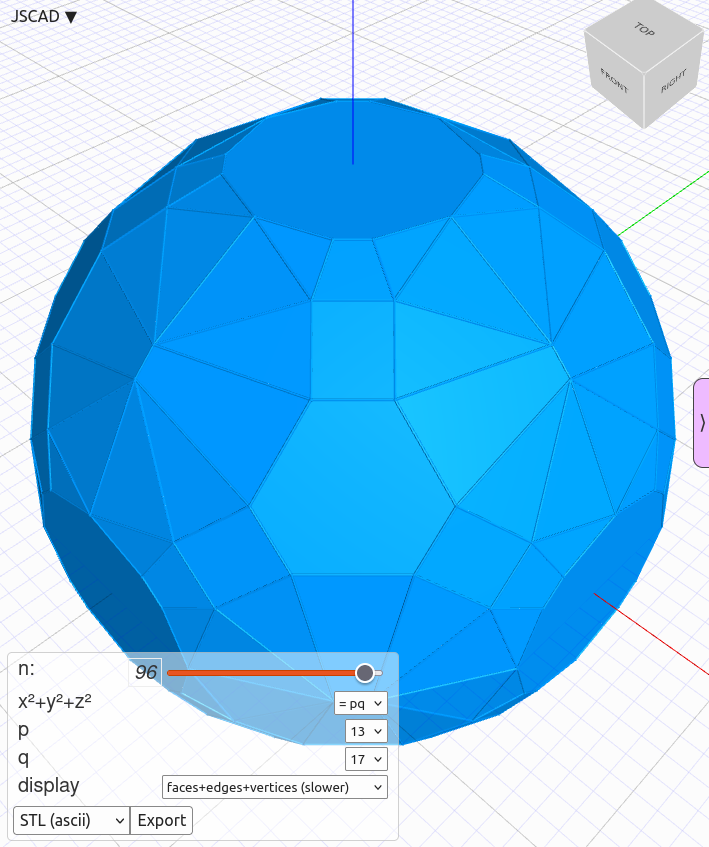

# lattice_sphere_cmp

$hull(p\in\mathbb{Z}^3, norml2(p)==n)$ for $n\neq 4^a(8b+7)$ is a [lattice polyhedron](https://en.wikipedia.org/wiki/Polyhedron#Lattice_polyhedra). By [Legendre's three-square theorem](https://en.wikipedia.org/wiki/Legendre%27s_three-square_theorem), such $n$ have representation(s) as the sum of $3$ squares.

After updating <kbd>lattice_sphere_cmp.js</kbd>, run <kbd>make</kbd> and then open [index.html](index.html) in browser.

Related question:  
https://math.stackexchange.com/questions/4917740/which-faces-does-sphere-lattice-polyhedron-operatornamehullp-in-mathbbz

